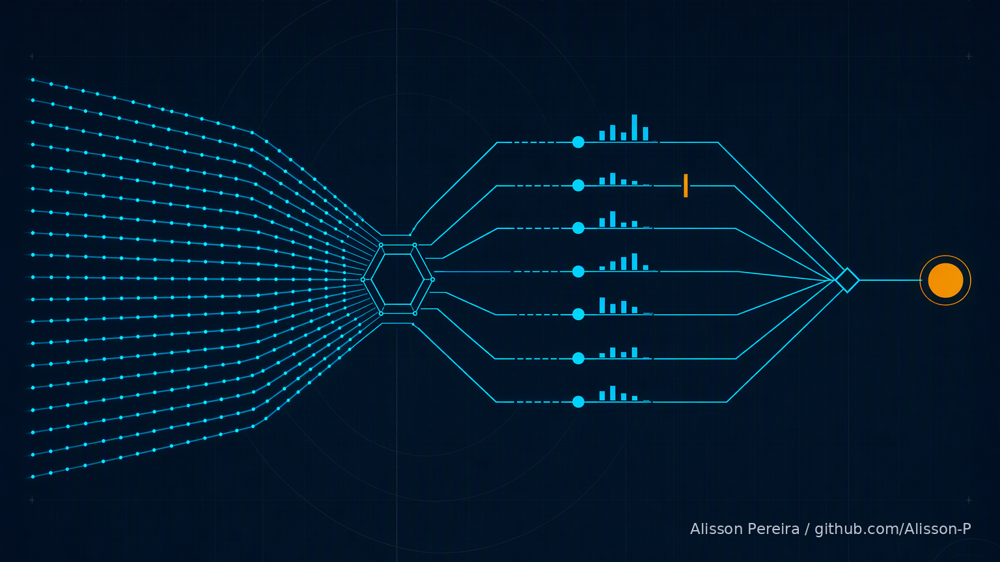
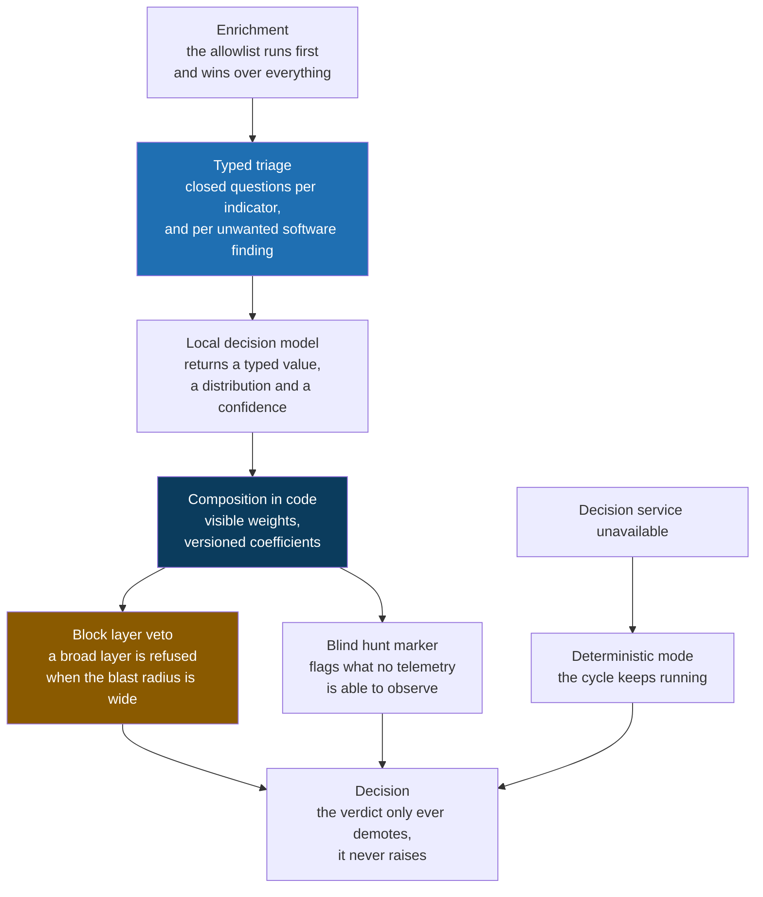

# IOC, PUA and Automated Hunting, typed decision variant

**The same open source platform, with one layer replaced: indicator triage decided through typed questions instead of free text.**

[Leia em português](README.pt-BR.md) | [Base platform](https://github.com/Alisson-P/ioc-pua-hunting)

> A model that writes prose cannot be held to a threshold. One that answers closed questions with a number can.

This is the public preview of the second build of my threat intelligence platform. It is identical to the base one everywhere except in a single place: how an indicator gets triaged before it is allowed to become a block.

I built it because of something that kept bothering me in the first version. When software needs a judgment from a model, the usual path is to ask for JSON inside a prompt and parse the answer back. I did that, it worked most of the time, and "most of the time" is exactly the problem when the output decides whether a domain stops resolving for the whole company.

## The problem

Asking a language model for a verdict in prose has three defects, and I ran into all three.

**The format breaks.** One extra comma, a markdown fence wrapped around the answer, a polite explanation before the JSON, and the parser fails. You can harden the parser forever and you are still writing defensive code against a text generator.

**The value arrives outside the domain.** I asked for one of four words: confirm, demote, reject, inconclusive. What came back was "probably confirm, but it depends on whether the hosting is shared". That is a reasonable thing for a person to say and a useless thing for a branch to evaluate.

**Confidence written in prose is not calibrated.** When a model says "high confidence", that is a figure of speech, not a number. You cannot compare it to another one, you cannot plot it against accuracy, and you certainly cannot set a threshold on it in code.

Because of those three, in the base platform the model layer is advisory only, by design. It writes, it summarizes, it proposes a hypothesis, and it never touches the band, the action or the classification. That is a safe answer. It is also an admission that the layer is not trusted with anything that matters.

## The core idea

Invert the direction. Instead of the code asking for text and interpreting it, the code sends a **state** and a set of **typed questions**, and receives **typed values** back, each with a probability distribution and a confidence figure. No text is generated and no text is parsed.

Three primitives carry everything:

| Primitive | Asks | Returns |
|---|---|---|
| **Noul** | Is this statement true? | a number between 0 and 1 |
| **Choice** | Which of these options? | the option, the distribution, the confidence |
| **Score** | Which level on this rubric? | the level, the distribution, the confidence |

**The questions are atomic, and that is the rule that is easiest to break.** A broad question hides several judgments behind one answer. "Is this indicator a false positive?" bundles at least five separate assessments, and when it comes back wrong you cannot tell which one failed. So each one is asked on its own, against the same state, and no answer becomes hidden context for another.

**The code composes, not the model.** The answers are combined with weights that sit in a versioned file, in the open, where anyone can read what the platform believes and what it believes more strongly. When priorities change you change a coefficient and record why. Under the old approach you rewrote a prompt and hoped.

**The weights here are the mirror image of the ones in my vulnerability work, on purpose.** In vulnerability management the expensive error is demoting a true finding: the flaw stays and nobody fixes it. In threat intelligence the expensive error is the opposite, blocking legitimate infrastructure, so the heaviest weight in the bank is the question about shared infrastructure, and there is a rubric that measures the cost of being wrong rather than the benefit of being right.

Two mechanisms came out of that and they are the part I am most pleased with.

**The block layer veto.** The model proposes where to apply the indicator: DNS, the proxy, the firewall, the endpoint, the mail gateway, or monitor only. If it picks a broad layer and the blast radius rubric says shared infrastructure, the code refuses the proposal and downgrades it to monitor only, recording why. The model proposes, the code decides, and the code stops trusting the proposal exactly where a mistake is expensive.

**The blind hunt marker.** If the telemetry question says no log can observe that kind of indicator, the item is flagged, along with the telemetry that was missing. This fixes a real blind spot in the base platform: without the flag, a hunt that had nowhere to look reports "hunted, nothing found", and a tired team reads that as good news.

Three quality locks sit under all of it. An answer outside the domain becomes an abstention rather than an invented value, and the code reads it as "I do not know" and not as "no". A verdict only counts if enough of the question weight came back valid, otherwise it is inconclusive. And confidence routes the outcome, so an uncertain verdict goes to a person instead of quietly taking effect.

## How it fits together

Look at the bottom left of that diagram, because it is the part people ask about first. If the decision service is down, the pipeline does not stop and it does not wait. It falls back to deterministic rules and finishes the cycle. A missing model is allowed to cost you the extra judgment. It is never allowed to silently change a verdict.

And what this layer still cannot do is as deliberate as what it can. The triage only ever demotes, so it can lower a priority and never raise one. The legitimate infrastructure list is applied before it and wins over it. Nothing is closed automatically, because marking something a false positive stays a human decision. And the classification of unwanted software remains policy, versioned and changed by pull request, because a model can tell you a tool is remote access software but not whether your company allows it.

## Built with

| Purpose | Tools |
|---|---|
| Decision layer | a local open weight decision model, Apache 2.0, plus a deterministic fallback |
| Interchangeable backends | the local model, a served language model, a hosted comparison arbiter, and rules only |
| Contract | typed questions over a small local HTTP service, NDJSON records, JSONL audit trail |
| The platform underneath | MISP, OpenCTI, IntelOwl, Suricata, Zeek, DNS RPZ, Wazuh |
| Hunting languages | KQL, Sigma, YARA, osquery |
| Formats and frameworks | STIX 2.1, MISP core format, MITRE ATT&CK |
| Runtime | Python, Docker Compose |

The decision model runs locally and nothing about the environment leaves it. That was not a nice to have. An indicator state carries the value that was hunted, the host it appeared on and the user involved, so sending it to a third party would contradict the rules of engagement the project is built on. There is a hosted backend in the code, but it exists to compare against, its payload is redacted by default, and sending it complete takes an explicit flag and prints a warning.

## A few numbers

| | |
|---|---|
| Typed questions asked per indicator | 11 |
| Typed questions asked per unwanted software finding | 3 |
| Primitives the whole layer is built from | 3 |
| Interchangeable backends behind one interface | 4 |
| Questions that decompose false positive risk | 5 |
| Rubrics that measure impact and blast radius | 2 |
| Thresholds set in code, each requiring a recorded decision to change | 6 |
| Verdicts the layer can reach, abstention included | 5 |

## What this preview is, and what it is not

**In here:** the design of the decision layer, the reasoning behind it, and what it deliberately refuses to do.

**Not in here:** source code, the step by step implementation guides, the architecture document, the measurement of the layer against the baseline, and any sample output. All of that lives in a separate private repository.

The base platform, without this layer, has its own public preview: [ioc-pua-hunting](https://github.com/Alisson-P/ioc-pua-hunting). The two exist side by side on purpose, so that one can be measured against the other on identical input.

There are no screenshots yet, and I would rather say that plainly than dress up something I have not run end to end for an audience. Sample runs with fictitious data are the next thing planned for this repository, and they will show up here when they exist.

## About

I am a cloud security consultant working with threat intelligence, security posture and detection engineering. I build these projects to think problems through properly, which for me means writing the design down until it survives being read by someone who was not in my head when I wrote it.

If you want to see the full content, the code, the guides or the architecture document, get in touch: [github.com/Alisson-P](https://github.com/Alisson-P)

## License

This preview is licensed under [Creative Commons Attribution NonCommercial NoDerivatives 4.0 International](https://creativecommons.org/licenses/by-nc-nd/4.0/) (CC BY-NC-ND 4.0).

It is content, not a code release. You may share it with attribution, for non commercial purposes, with no derivative works.

Alisson Pereira / [github.com/Alisson-P](https://github.com/Alisson-P)
