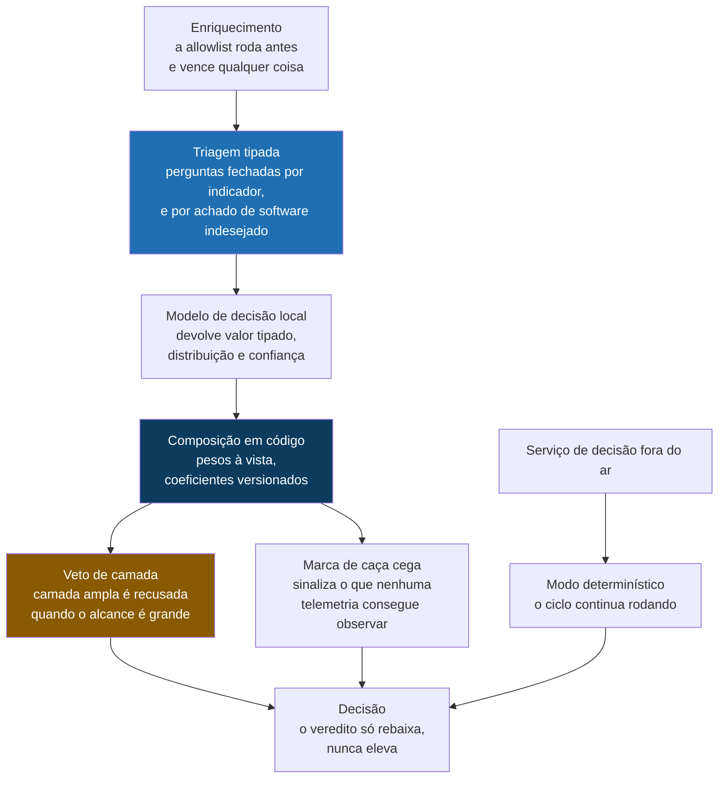

# IOC, PUA e Caça Automática, variante com decisões tipadas

**A mesma plataforma open source, com uma camada trocada: a triagem de indicadores decidida por perguntas tipadas em vez de texto livre.**

[Read this in English](README.md) | [Plataforma base](https://github.com/Alisson-P/ioc-pua-hunting)

> Um modelo que escreve prosa não pode ser submetido a um limiar. Um que responde perguntas fechadas com um número, pode.

Esta é a prévia pública da segunda versão da minha plataforma de inteligência de ameaças. Ela é idêntica à base em tudo, menos num ponto: como um indicador é triado antes de ter permissão para virar bloqueio.

Construí por causa de uma coisa que não me largava na primeira versão. Quando o software precisa de um julgamento do modelo, o caminho de sempre é pedir um JSON dentro do prompt e interpretar a resposta de volta. Foi o que eu fiz, funcionava na maior parte das vezes, e "na maior parte das vezes" é exatamente o problema quando a saída decide se um domínio para de resolver para a empresa inteira.

## O problema

Pedir um veredito em prosa a um modelo de linguagem tem três defeitos, e eu esbarrei nos três.

**O formato quebra.** Uma vírgula a mais, um bloco de markdown em volta da resposta, uma explicação educada antes do JSON, e o analisador falha. Dá para blindar o analisador para sempre, e mesmo assim você continua escrevendo código defensivo contra um gerador de texto.

**O valor chega fora do domínio.** Eu pedi uma entre quatro palavras: confirma, rebaixa, rejeita, inconclusivo. O que voltou foi "provavelmente confirma, mas depende de a hospedagem ser compartilhada". É uma coisa razoável para uma pessoa dizer e uma coisa inútil para um `if` avaliar.

**Confiança escrita em prosa não é calibrada.** Quando o modelo diz "alta confiança", isso é figura de linguagem, não número. Você não compara com outro, não traça contra acerto, e definitivamente não aplica um limiar em cima disso no código.

Por causa desses três, na plataforma base a camada de modelo é apenas consultiva, por decisão de arquitetura. Ela escreve, resume, propõe hipótese, e nunca encosta na banda, na ação ou na classificação. É uma resposta segura. Também é a admissão de que não se confia nela para nada que importe.

## A ideia central

Inverter a direção. Em vez de o código pedir texto e interpretar, o código manda um **estado** e um conjunto de **perguntas tipadas**, e recebe de volta **valores tipados**, cada um com distribuição de probabilidade e um número de confiança. Não se gera texto e não se interpreta texto.

Três primitivas sustentam tudo:

| Primitiva | Pergunta | Devolve |
|---|---|---|
| **Noul** | Esta afirmação é verdadeira? | um número entre 0 e 1 |
| **Choice** | Qual destas opções? | a opção, a distribuição, a confiança |
| **Score** | Qual nível nesta rubrica? | o nível, a distribuição, a confiança |

**As perguntas são atômicas, e essa é a regra mais fácil de quebrar.** Uma pergunta ampla esconde vários julgamentos atrás de uma resposta só. "Este indicador é falso positivo?" empacota pelo menos cinco avaliações separadas, e quando volta errada você não consegue dizer qual delas falhou. Então cada uma é feita sozinha, contra o mesmo estado, e nenhuma resposta vira contexto escondido de outra.

**Quem compõe é o código, não o modelo.** As respostas são combinadas com pesos que moram num arquivo versionado, à vista, onde qualquer um lê no que a plataforma acredita e no que ela acredita com mais força. Quando a prioridade muda, você muda um coeficiente e registra o porquê. No jeito antigo, você reescrevia um prompt e torcia.

**Os pesos aqui são o espelho dos do meu trabalho de vulnerabilidades, de propósito.** Em gestão de vulnerabilidades o erro caro é rebaixar um achado verdadeiro: a falha fica e ninguém corrige. Em inteligência de ameaças o erro caro é o oposto, bloquear infraestrutura legítima, então o maior peso do banco é a pergunta sobre infraestrutura compartilhada, e existe uma rubrica que mede o custo do erro em vez do benefício do acerto.

Dois mecanismos saíram daí, e são a parte de que eu mais gosto.

**O veto de camada de bloqueio.** O modelo propõe onde aplicar o indicador: DNS, proxy, firewall, endpoint, gateway de correio, ou apenas monitorar. Se ele escolher uma camada ampla e a rubrica de alcance disser infraestrutura compartilhada, o código recusa a proposta, rebaixa para somente monitorar e registra o motivo. O modelo propõe, o código decide, e o código para de confiar na proposta exatamente onde o erro é caro.

**A marca de caça cega.** Se a pergunta sobre telemetria disser que não existe registro capaz de observar aquele tipo de indicador, o item sai marcado, junto com a telemetria que faltou. Isso conserta um ponto cego real da plataforma base: sem a marca, uma caça que não tinha onde procurar relata "caçado, nada encontrado", e um time cansado lê isso como boa notícia.

Três travas de qualidade ficam por baixo de tudo. Resposta fora do domínio vira abstenção em vez de valor inventado, e o código lê como "não sei", não como "não". Um veredito só vale se boa parte do peso das perguntas voltou válida, senão é inconclusivo. E a confiança roteia o desfecho, então veredito incerto vai para uma pessoa em vez de surtir efeito caladinho.

## Como as peças se encaixam

Olhe o canto inferior esquerdo do diagrama, porque é a parte que perguntam primeiro. Se o serviço de decisão cair, a esteira não para e não espera. Ela desce para regras determinísticas e termina o ciclo. Modelo ausente tem permissão de custar a você o julgamento extra. Nunca tem permissão de mudar um veredito em silêncio.

E o que esta camada continua não podendo fazer é tão deliberado quanto o que ela pode. A triagem só rebaixa, então ela abaixa prioridade e nunca levanta. A lista de infraestrutura legítima é aplicada antes dela e vence ela. Nada é fechado automaticamente, porque marcar alguma coisa como falso positivo continua sendo decisão humana. E a classificação de software indesejado continua sendo política, versionada e alterada por pull request, porque um modelo consegue dizer que uma ferramenta é de acesso remoto, mas não se a sua empresa permite.

## Feito com

| Para que serve | Ferramentas |
|---|---|
| Camada de decisão | um modelo de decisão local de pesos abertos, Apache 2.0, mais o determinístico de reserva |
| Backends intercambiáveis | o modelo local, um modelo de linguagem servido, um árbitro hospedado de comparação, e só regras |
| Contrato | perguntas tipadas sobre um serviço HTTP local pequeno, registros NDJSON, trilha de auditoria JSONL |
| A plataforma por baixo | MISP, OpenCTI, IntelOwl, Suricata, Zeek, DNS RPZ, Wazuh |
| Linguagens de caça | KQL, Sigma, YARA, osquery |
| Formatos e frameworks | STIX 2.1, formato MISP, MITRE ATT&CK |
| Execução | Python, Docker Compose |

O modelo de decisão roda localmente e nada do ambiente sai dali. Isso não era item desejável. O estado de um indicador carrega o valor que foi caçado, o host em que ele apareceu e o usuário envolvido, então mandar isso para terceiro contrariaria as regras de engajamento em que o projeto foi construído. Existe um backend hospedado no código, mas ele está lá para comparar, o conteúdo vai redigido por padrão, e mandar completo exige um parâmetro explícito e imprime aviso.

## Alguns números

| | |
|---|---|
| Perguntas tipadas feitas por indicador | 11 |
| Perguntas tipadas feitas por achado de software indesejado | 3 |
| Primitivas das quais a camada inteira é feita | 3 |
| Backends intercambiáveis atrás de uma interface | 4 |
| Perguntas que decompõem o risco de falso positivo | 5 |
| Rubricas que medem impacto e alcance | 2 |
| Limiares fixados em código, cada um exigindo decisão registrada para mudar | 6 |
| Vereditos que a camada pode alcançar, abstenção incluída | 5 |

## O que esta prévia é, e o que ela não é

**Está aqui:** o desenho da camada de decisão, o raciocínio atrás dela, e o que ela recusa fazer de propósito.

**Não está aqui:** código fonte, os guias de implementação passo a passo, o documento de arquitetura, a medição da camada contra a linha de base, e qualquer amostra de saída. Tudo isso mora num repositório privado separado.

A plataforma base, sem esta camada, tem prévia pública própria: [ioc-pua-hunting](https://github.com/Alisson-P/ioc-pua-hunting). As duas existem lado a lado de propósito, para que uma possa ser medida contra a outra sobre a mesma entrada.

Ainda não tem captura de tela, e eu prefiro dizer isso na lata a maquiar alguma coisa que eu não rodei de ponta a ponta para mostrar. Execuções de exemplo com dados fictícios são o próximo passo previsto para este repositório, e vão aparecer aqui quando existirem.

## Sobre

Sou consultor de segurança em nuvem e trabalho com inteligência de ameaças, postura de segurança e engenharia de detecção. Construo esses projetos para pensar os problemas direito, o que para mim significa escrever o desenho até ele sobreviver a ser lido por alguém que não estava na minha cabeça quando eu escrevi.

Se você quiser ver o conteúdo completo, o código, os guias ou o documento de arquitetura, me chame: [github.com/Alisson-P](https://github.com/Alisson-P)

## Licença

Esta prévia está sob a licença [Creative Commons Atribuição NãoComercial SemDerivações 4.0 Internacional](https://creativecommons.org/licenses/by-nc-nd/4.0/deed.pt-br) (CC BY-NC-ND 4.0).

Ela é conteúdo, não uma liberação de código. Você pode compartilhar com atribuição, para fins não comerciais, sem obras derivadas.

Alisson Pereira / [github.com/Alisson-P](https://github.com/Alisson-P)
